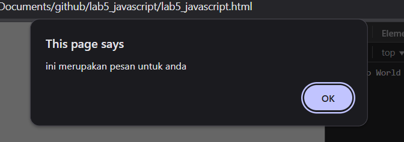

### Nama : Albhani Fadillah Haryady
### NIM : 312410130
### kelas : TI 24 A 1

# Praktikum 5

## Langkah-langkah Praktikum

Persiapan membuat dokumen HTML dengan nama file lab5_javascript.html seperti berikut.

```html
<!DOCTYPE html>
<html lang="en">
<head>
<title>Mengenal JavaScript</title>
</head>
<body>
<h1>Pengenalan JavaScript</h1>
<h3>Contoh document.write dan console.log</h3>
<script>
document.write("Hello World");
console.log("Hello World");
</script>
</body>
</html>
```

### 1. Pemakaian Alert sebagai property window.

```html
<html>
<head>
  <title>alert box</title>
</head>
<body>
  <script language="javascript">
    <!--
    window.alert("ini merupakan pesan untuk anda");
    //-->
  </script>
</body>
</html>

```


### 2. Pemakaian method dalam objek

```html
<html>
<head>
  <title>skrip javascript</title>
</head>
<body>
  percobaan memakai javascript:<br>
  <script language="javascript">
    <!--
    document.write("selamat mencoba javascript<br>");
    document.write("semoga sukses!");
    //-->
  </script>
</body>
</html>
```


### 3. Pemakaian Prompt

```html
<html>
<head>
  <title>Pemasukan Data</title>
</head>
<body>
  <script language="javascript">
    var nama = prompt("Siapa nama Anda:", "Masukkan nama Anda");
    document.write("Hai, " + nama);
  </script>
</body>
</html>
```


### 4. Pembuatan fungsi dan cara pemanggilannya

```html
<html>
<head>
  <title>Contoh Program JavaScript</title>
  <script language="javascript">
    function pesan() {
      alert("Memanggil JavaScript lewat body onload");
    }
  </script>
</head>
<body onload="pesan()">
</body>
</html>
```


### 5. Operasi dasar aritmatika

```html
<html>
<head>
  <title>contoh program javascript</title>
  <script language="javascript">
    function test(val1, val2) {
      document.write("<br>Perkalian : " + val1 * val2 + "<br>");
      document.write("<br>Pembagian : " + val1 / val2 + "<br>");
      document.write("<br>Penjumlahan : " + val1 + val2 + "<br>");
      document.write("<br>Pengurangan : " + (val1 - val2) + "<br>");
      document.write("<br>Modulus : " + (val1 % val2) + "<br>");
    }
  </script>
</head>

<body>
  <input type="button" name="button1" value="arithmetic" onclick="test(9,4)">
</body>
</html>

```


### 6. Seleksi kondisi (if..else)

```html
<html>
<head>
  <title>contoh if-else</title>
</head>

<body>
  <script language="javascript">
    <!--
    var nilai = prompt("nilai (0-100): ", 0);
    var hasil = "";

    if (nilai >= 60)
      hasil = "lulus";
    else
      hasil = "tidak lulus";

    document.write("hasil: " + hasil);
    //-->
  </script>
</body>
</html>
```


### 7. Penggunaan operator switch untuk seleksi kondisi
Selanjutnya mengatur main content dan sidebar, tambahkan CSS float.
```html
<html>
<head>
  <title>Contoh Program JavaScript</title>
  <script language="javascript">
    function test() {
      val1 = window.prompt("Input nilai (1-5):");
      switch (val1) {
        case "1":
          document.write("Bilangan satu");
          break;
        case "2":
          document.write("Bilangan dua");
          break;
        case "3":
          document.write("Bilangan tiga");
          break;
        case "4":
          document.write("Bilangan empat");
          break;
        case "5":
          document.write("Bilangan lima");
          break;
        default:
          document.write("Bilangan lainnya");
      }
    }
  </script>
</head>
<body>
  <input type="button" name="button1" value="Switch" onclick="test()">
</body>
</html>
```


### 8. Pembuatan Form (Form Input)
Kemudian selanjutnya menambahkan element lain dalam sidebar.

```html
<html>
<head>
  <script language="javascript">
    function test() {
      var val1 = document.kirim.T1.value;
      if (val1 % 2 == 0)
        document.kirim.T2.value = "bilangan genap";
      else
        document.kirim.T2.value = "bilangan ganjil";
    }
  </script>
</head>

<body>
  <form method="POST" name="kirim">
    <p>BIL <input type="text" name="T1" size="20"></p>
    <p>MERUPAKAN BIL <input type="text" name="T2" size="20"></p>
    <p><input type="button" value="TEBAK" name="B1" onclick="test()"></p>
  </form>
</body>
</html>
```


### 9. Form Button
Selanjutnya mengatur tampilan footer. Tambahkan CSS untuk footer.
```html
<html>
<head>
  <title>objek document</title>
</head>

<body>
  <script language="javascript">
    <!--
    function ubahWarnaLB(warna) {
      document.bgColor = warna;
    }
    function ubahWarnaLD(warna) {
      document.fgColor = warna;
    }
    //-->
  </script>

  <h1>tes</h1>
  <form>
    <input type="button" value="Latar Belakang Hijau" onclick="ubahWarnaLB('GREEN')">
    <input type="button" value="Latar Belakang Putih" onclick="ubahWarnaLB('WHITE')">
    <input type="button" value="Teks Kuning" onclick="ubahWarnaLD('YELLOW')">
    <input type="button" value="Teks Biru" onclick="ubahWarnaLD('BLUE')">
  </form>

  <script language="javascript">
    <!--
    document.write("Dimodifikasi terakhir pada " + document.lastModified);
    //-->
  </script>
</body>
</html>
```


### 10. HTML DOM

```html
<html>
<head>
  <title>Daftar Menu</title>
  <script>
    function hitung(ele) {
      var total = document.getElementById('total').value;
      total = (total ? parseInt(total) : 0);
      var harga = 0;

      if (ele.checked) {
        harga = ele.value;
        total += parseInt(harga);
      } else {
        harga = ele.value;
        if (total > 0)
          total -= parseInt(harga);
      }

      document.getElementById('total').value = total;
    }
  </script>
</head>

<body>
  <h1>Daftar Menu Makanan</h1>

  <label>
    <input type="checkbox" value="5000" id="menu1" onclick="hitung(this);" />
    Ayam Goreng Rp. 5.000
  </label><br>

  <label>
    <input type="checkbox" value="500" id="menu2" onclick="hitung(this);" />
    Tempe Goreng Rp. 500
  </label><br>

  <label>
    <input type="checkbox" value="2500" id="menu3" onclick="hitung(this);" />
    Telur Dadar Rp. 2.500
  </label><br>

  <strong>
    Total Bayar: Rp. <input id="total" type="text" />
  </strong>
</body>
</html>
```


# Pertanyaan dan Tugas
1. Buat script untuk melakukan validasi pada isian form.


